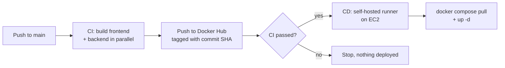

# Day 48: GitHub Actions Capstone, End-to-End CI/CD

For the capstone I didn't build a tiny demo app. I took **DevBoard**, a 3-tier app (React frontend, Go backend, Postgres), and built a real CI/CD pipeline around it: every push to `main` builds both images, pushes them to Docker Hub, and deploys them to an EC2 instance automatically.

**Repo:** https://github.com/SnigdhaChaudhari611/devboard-starter
**Docker Hub:**
- https://hub.docker.com/r/snigdhach/devboard-frontend
- https://hub.docker.com/r/snigdhach/devboard-backend

---

## The App

| Layer | Tech | How it runs |
|---|---|---|
| Frontend | React + Vite | Multi-stage Docker build, exposed on port 8080 on the host |
| Backend | Go (Gin) | Multi-stage Docker build |
| Database | Postgres 16 (alpine) | Docker volume for data, healthcheck before the backend starts |

All three run together with Docker Compose.

---

## Pipeline Architecture



Plain text version:

```
push to main → CI (matrix build: frontend + backend) → push images (SHA tag) → CD (on EC2) → compose pull + up
push a v1.2.0 tag → same flow, images also get a 1.2.0 tag
```

### CI (`ci.yml`)
- **Trigger:** push to `main`, or a version tag like `v1.0.0`
- **Matrix:** `service: [frontend, backend]` runs two parallel jobs, each building from its own folder (`./frontend`, `./backend`)
- **Tags:** `docker/metadata-action` generates the tags
  - every build: full commit SHA (e.g. `snigdhach/devboard-backend:5ffd54b...`)
  - release builds: semantic version (e.g. `1.2.0`)
- **Push:** `docker/build-push-action` builds and pushes to Docker Hub

### CD (`cd.yml`)
- **Trigger:** runs after CI succeeds
- **Runs on:** a self-hosted runner installed on the EC2 instance, so no SSH port needs to be open for GitHub
- **Deploys:** sets `IMAGE_TAG` to the commit SHA, then `docker compose pull && docker compose up -d`
- Compose uses `image: snigdhach/devboard-<service>:${IMAGE_TAG}`, so the server always runs exactly the commit that was just built

---

## Workflow Files

<!-- Run this from the devboard-starter repo root to paste every workflow file below, exactly as it is in the repo:
for f in .github/workflows/*.yml; do echo "### \`$f\`"; echo; echo '```yaml'; cat "$f"; echo '```'; echo; done >> day-48-actions-project.md
-->

(workflow files go here)

---

## Screenshots

- CI run with both matrix jobs: ``
- CD run deploying to EC2: ``
- Images on Docker Hub with SHA tags: ``
- App running on EC2: ``

---

## How It Maps to the Day 48 Tasks

| Task | Status | Notes |
|---|---|---|
| 1. Project repo with app, Dockerfile, README | ✅ Done | DevBoard, 2 Dockerfiles (frontend + backend) |
| 2. Reusable build & test workflow | 🟡 Partly | Reusable workflows via `workflow_call`, but no `inputs` / `outputs` yet |
| 3. Reusable Docker build & push | 🟡 Partly | Builds and pushes SHA tags, but no `image_name` / `tag` inputs or `image_url` output yet |
| 4. PR pipeline (tests only, no push) | ⬜ Not yet | |
| 5. Main pipeline: test → build → deploy | ✅ Done | Deploys for real to EC2, not just a print statement |
| 6. Scheduled health check | ⬜ Not yet | |
| 7. Badges + architecture diagram | 🟡 Partly | Diagram above, badges below |
| Brownie points: Trivy scan | ✅ Done | Covered properly in Day 49 (DevSecOps) |

---

## Why SHA Tags Instead of `latest`

`latest` gets overwritten on every push, so there's no history of what was deployed and nothing to roll back to. Tagging with the commit SHA means:

- every image maps to an exact commit
- CD deploys that exact image, not "whatever latest is right now"
- rolling back = redeploying an older SHA

Semantic version tags (`v1.2.0`) are for real releases on top of that.

---

## Things I Learned the Hard Way

**Docker / images**
- **The legacy builder is deprecated.** `--provenance` failed until I installed buildx.
- **`no space left on device`**: an 8 GB EC2 disk fills up fast with images and build cache. `docker builder prune -af` and `docker image prune` help, bigger EBS volume helps more.
- **Pushing a multi-platform manifest list fails** if you only have one platform's layers locally. Building with `--platform linux/amd64 --provenance=false` gives a clean single-platform image.
- **Docker Hardened Images need `docker login dhi.io`**, separate from Docker Hub login.

**GitHub Actions**
- **Every job runs on a fresh machine.** An image built in one job doesn't exist in the next one.
- **`metadata-action` rules go in the metadata step, not in build-push-action.** Putting `type=sha` in build-push-action makes it treat it as a literal (invalid) tag name.
- **Semver-only tag rules produce zero tags on a normal push to main** → `tag is needed when pushing to registry`. Always include a SHA rule.
- **`workflow_run` matches the workflow's `name:` exactly.** If CI is named "Docker Build & Push", a CD listening for "CI" never runs.
- **`github.event.workflow_run.head_sha` is empty when CD is called with `workflow_call`.** Use `github.sha` there.
- **`vars.` and `secrets.` are different tabs.** A value in the wrong tab silently becomes an empty string.
- **`npm ci` needs a lockfile that matches package.json exactly.** A lockfile generated on a Mac can miss Linux-only optional packages. Fix: delete it and regenerate.

**Deploying to EC2**
- **SSH deploy from GitHub needs port 22 open to `0.0.0.0/0`** (runner IPs change) and the full private key including the BEGIN/END lines. A dedicated deploy key is cleaner than reusing my personal `.pem`.
- **Use the public IP, not the private one** (`172.31.x.x` isn't reachable from the internet).
- **A green CD job doesn't mean it deployed.** Without `set -e`, a failed `cd` still ended with a successful `docker image prune`, so the job passed while nothing deployed.
- **`invalid proto:` from docker compose** means a port variable is empty (`":4173"`). Every time, it was a missing or empty `.env`.
- **`${IMAGE_TAG:-latest}` hides bugs.** When IMAGE_TAG was empty, compose silently tried `latest`, which didn't exist. `${IMAGE_TAG:?not set}` fails loudly instead.
- **Self-hosted runner = no inbound SSH needed.** The runner connects out to GitHub, which is why I switched to it.

**Git**
- **Editing on GitHub's website and locally at the same time** leads to divergent branches. `git pull --rebase` fixes it, editing in one place avoids it.

---

## Status Badges

Add to `README.md`:

```markdown


```

(Change the file names if yours are different.)

---

## What I'd Improve Next

- [ ] PR pipeline that runs tests only, no push or deploy (Task 4)
- [ ] Scheduled health check every 12 hours with a `$GITHUB_STEP_SUMMARY` report (Task 6)
- [ ] Add `inputs` / `outputs` to the reusable workflows (Tasks 2, 3)
- [ ] `environment: production` with required reviewers before deploy
- [ ] Rollback workflow: redeploy a chosen older SHA with `workflow_dispatch`
- [ ] Security scanning at every stage → that's Day 49
