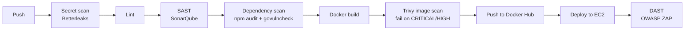

# Day 49: DevSecOps, Adding Security to My CI/CD Pipeline

I used to be scared of the word "DevSecOps" itself. Turns out it just means **adding security checks to the pipeline you already have**, so problems get caught automatically on every push instead of weeks later in production. Security stops being a separate scary step at the end and becomes a few extra stages in the automation.

I added these to the same **DevBoard** project from Day 48 (React frontend, Go backend, Postgres, deployed to EC2 with a self-hosted runner).

**Repo:** https://github.com/SnigdhaChaudhari611/devboard-starter

---

## My Secure Pipeline

Every push runs one orchestrator workflow (`devsecops_pipeline.yml`) that calls reusable workflows in order. Each stage only runs if the one before it passed, so nothing insecure gets pushed or deployed.



Plain text version:

```
Push
  → secret scan (Betterleaks, full git history)       ← NEW
  → lint
  → SAST (SonarQube)                                   ← NEW
  → dependency scan (npm audit + govulncheck)          ← NEW
  → Docker build
  → Trivy image scan (fail on CRITICAL/HIGH)           ← NEW
  → Docker push (only if every scan passed)
  → deploy to EC2
  → DAST (OWASP ZAP attacks the live app)              ← NEW

Always active
  → GitHub secret scanning + push protection           ← NEW
```

| Stage | Tool | What it catches |
|---|---|---|
| Secret scan | Betterleaks | API keys, tokens, passwords anywhere in git history |
| SAST | SonarQube | Security flaws in my own source code |
| Dependency scan | npm audit, govulncheck | Known CVEs in the libraries I use |
| Image scan | Trivy | CVEs in the final Docker images (OS packages + binaries) |
| DAST | OWASP ZAP baseline | Problems in the running app (headers, misconfig) |
| Built-in | GitHub secret scanning + push protection | Secrets pushed to the repo, blocked before they land |

---

## Task 1: Trivy Image Scan

Trivy runs after the Docker build and before push. `exit-code: '1'` with `severity: CRITICAL,HIGH` fails the pipeline, so a vulnerable image never reaches Docker Hub.

**Base images:**
- Frontend: `dhi.io/node:26-dev` for the build stage, `nginxinc/nginx-unprivileged:stable-alpine` for runtime
- Backend: `dhi.io/golang:1-alpine` (Docker Hardened Image)

**What it found:** 2 CRITICAL CVEs in the frontend image, both inside an old **esbuild** binary compiled with Go 1.20.12:
- CVE-2024-24790 (net/netip)
- CVE-2025-68121 (crypto/tls)

**Root cause:** the frontend Dockerfile copied the entire `node_modules` into the production image just to run `vite preview`. So every build tool shipped to production.

**Fix:** rewrote the runtime stage to serve only the built `dist/` folder with nginx (non-root). No Node, no `node_modules`, no esbuild. Smaller image and a whole class of findings gone.

**One thing I did differently from the task:** the task uses `aquasecurity/trivy-action@master`. In March 2026, attackers force-pushed malicious code to most of that action's version tags to steal CI secrets. So I pinned it to a full commit SHA instead (more on this in the brownie points).

Screenshot: ``

---

## Task 2: GitHub Secret Scanning + Push Protection

Enabled in repo Settings → Code security → Secret scanning + Push protection. On top of that, my pipeline runs **Betterleaks** as the very first stage.

**Secret scanning vs push protection:**
- **Secret scanning** finds secrets that are *already* in the repo and alerts you. The damage may already be done.
- **Push protection** checks the push *before* it's accepted and blocks it if it contains a secret. The secret never reaches GitHub.

**What happens if GitHub detects a leaked AWS key?** GitHub partners with providers like AWS, so it notifies them and they can act on the key (for example, quarantine it). You also get an alert in the Security tab. But the real fix is always on me: **revoke the key first**, then remove it from the code. Deleting the file isn't enough, because it stays in git history forever.

**My test:** I committed a fake AWS key and a fake GitHub token on purpose.
- Betterleaks caught them and failed the pipeline.
- At first a later run didn't catch them, because the scanner only checked the commits in that push. With `fetch-depth: 0`, it scans the full history every time.
- Since fake secrets now live in history forever, I allowlisted their fingerprints in `.betterleaksignore` (only those exact findings, new leaks still get caught).

---

## Task 3: Dependency Scanning

The task uses `actions/dependency-review-action` on PRs. My pipeline runs on every push instead, so I scanned the full dependency tree with the native tools:

- **Frontend:** `npm audit --audit-level=high` (fails on HIGH or CRITICAL)
- **Backend:** `govulncheck ./...` (Go's official scanner, only reports vulnerabilities in code my app actually calls)

**What they found:**
- **npm:** 11 vulnerabilities (5 high) in postcss, browserslist, js-yaml, nanoid, react-router and more. `npm audit fix` fixed most, React Router needed a major upgrade (6 → 7) which I tested before committing.
- **Go:** 29 vulnerabilities reachable from my code. Most were in the **Go standard library itself**, because the backend was on Go 1.22, which no longer gets security fixes. Upgraded to Go 1.26 and updated all modules (Gin 1.10 → 1.12, x/net 0.25 → 0.59). Result: `No vulnerabilities found`.

**Difference from dependency review:** dependency-review only checks **new** dependencies added in a PR. npm audit / govulncheck check **everything** already installed. Both are useful: review blocks bad additions at the PR, full scans catch old packages that became vulnerable later.

---

## Task 4: Workflow Permissions

Added at the top of my workflow files:

```yaml
permissions:
  contents: read
```

**Why limit permissions?** By default the `GITHUB_TOKEN` can do a lot. If any action in my workflow gets compromised (like the trivy-action attack), it runs with whatever permissions the workflow has. With `contents: read`, a compromised action can read my code but can't push commits, change workflows, create releases or tamper with the repo. Least privilege limits the blast radius.

I also added `persist-credentials: false` to checkout steps, so the GitHub token isn't left behind on the runner (important on my self-hosted runner, which doesn't get wiped after each job).

---

## Beyond the Tasks: SAST and DAST

- **SAST (SonarQube)** reads my source code for security flaws before anything is built.
- **DAST (OWASP ZAP baseline)** runs after deploy and attacks the live app from outside, like a real attacker would.

**ZAP result:** 0 failures, 58 checks passed, 9 warnings, all missing security headers (Permissions-Policy, Cross-Origin-Embedder-Policy, Subresource Integrity). Those are fixable with a few `add_header` lines in `nginx.conf`.

Screenshot: ``

---

## Brownie Points

- ✅ **Pinned actions to commit SHAs:** Trivy is pinned to a full SHA after the March 2026 tag hijack. A tag like `@v4` or `@master` can be moved to point at malicious code. A commit SHA can't.
- 🟡 **SARIF upload:** Betterleaks already writes a SARIF report. Next step is uploading it (and Trivy's) to the Security tab with `github/codeql-action/upload-sarif`.
- ⬜ **OIDC:** not yet. My pipeline still uses a Docker Hub token stored as a secret. OIDC would replace long-lived cloud keys with short-lived tokens.

---

## Things I Learned the Hard Way

- **Scan the exact image you push.** Every job runs on a fresh machine, so if you scan in one job and push from another, you're rebuilding and pushing something that wasn't scanned. Build → scan → push in one job fixes it.
- **Secret scanners only check pushed commits by default.** `fetch-depth: 0` + a full-history scan catches old leaks too.
- **Use `--redact`** so the scanner doesn't print the leaked secret in plain text in the Actions logs.
- **`setup-go` with `go-version-file` installs the exact version in go.mod** (e.g. 1.26.0, unpatched). For security scans use `go-version: '1.26.x'` with `check-latest: true`.
- **`ignore-unfixed: true`** in Trivy stops the pipeline failing on CVEs that have no fix yet, so it only blocks on things I can actually fix.
- **Build tools don't belong in production images.** Multi-stage builds should ship only the output.
- **Docker Hardened Images need `docker login dhi.io`**, separate from Docker Hub.

---

## Workflow Files

<!-- Run this from the devboard-starter repo root to paste every workflow file below, exactly as it is in the repo:
for f in .github/workflows/*.yml; do echo "### \`$f\`"; echo; echo '```yaml'; cat "$f"; echo '```'; echo; done >> day-49-devsecops.md
-->

(workflow files go here)

---

## What I'd Improve Next

- [ ] Security headers in `nginx.conf` to clear the ZAP warnings
- [ ] Upload Trivy + Betterleaks SARIF to the GitHub Security tab
- [ ] `dependency-review-action` on a PR pipeline
- [ ] Pin *all* actions and base images to SHAs / digests (Dependabot to keep them updated)
- [ ] OIDC for AWS instead of stored credentials
